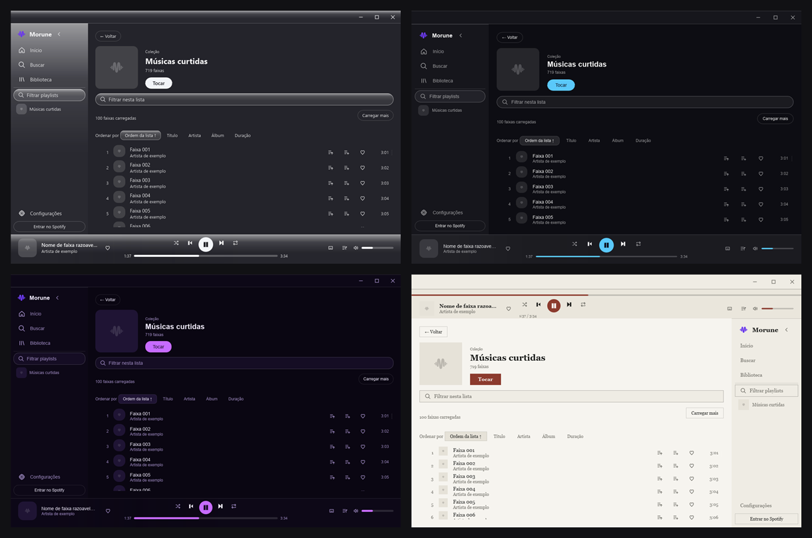
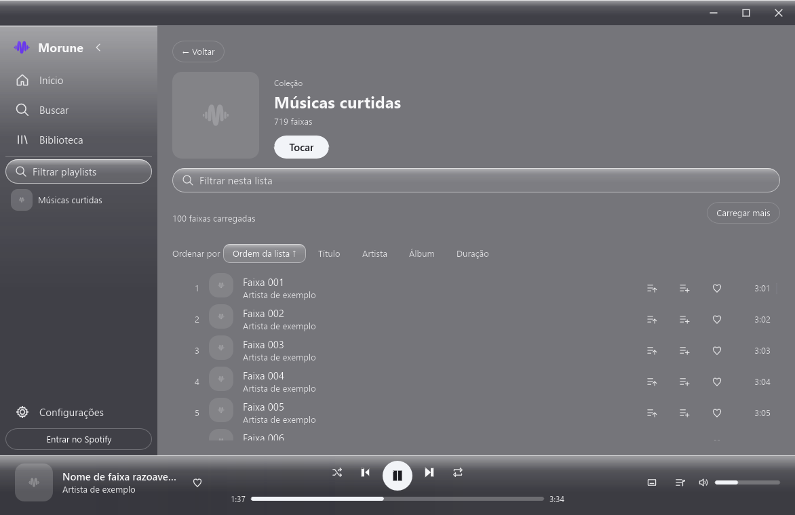
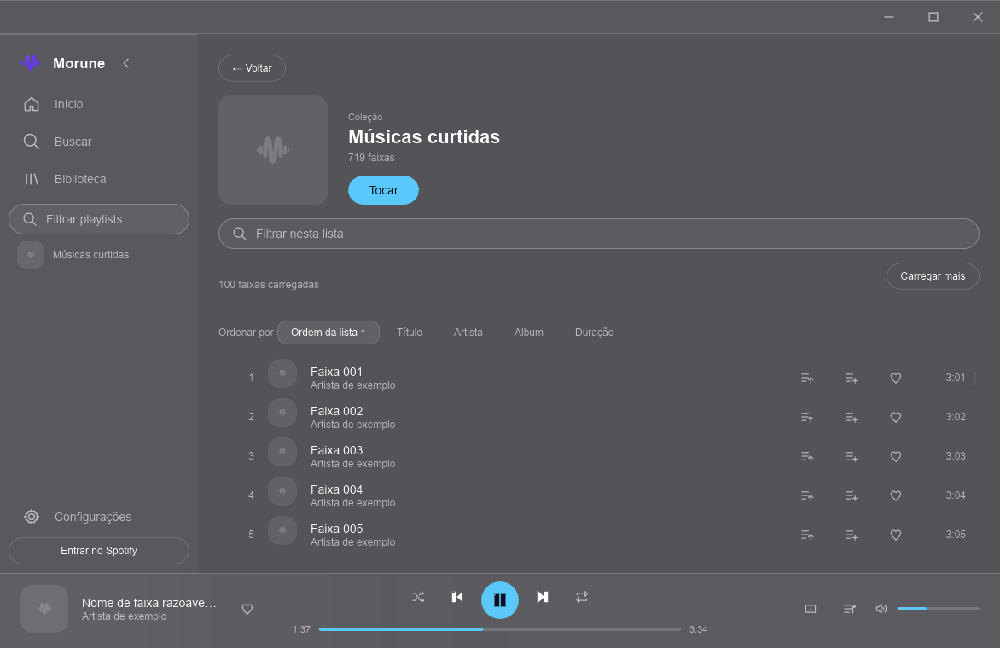
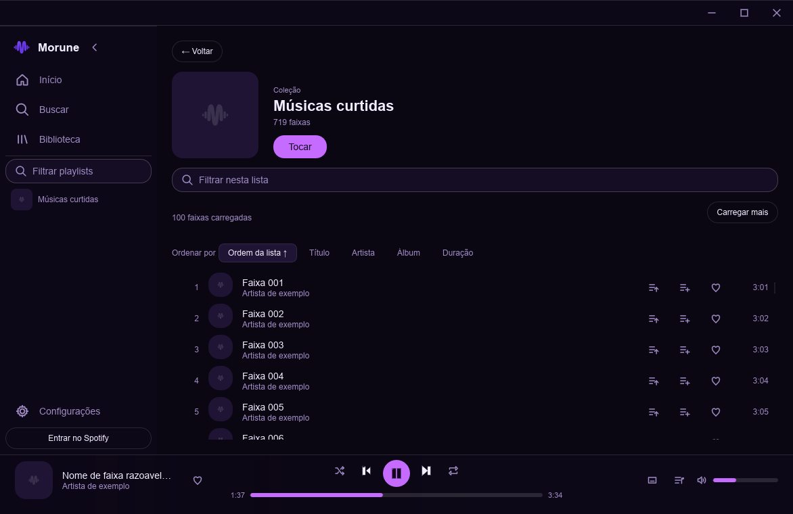
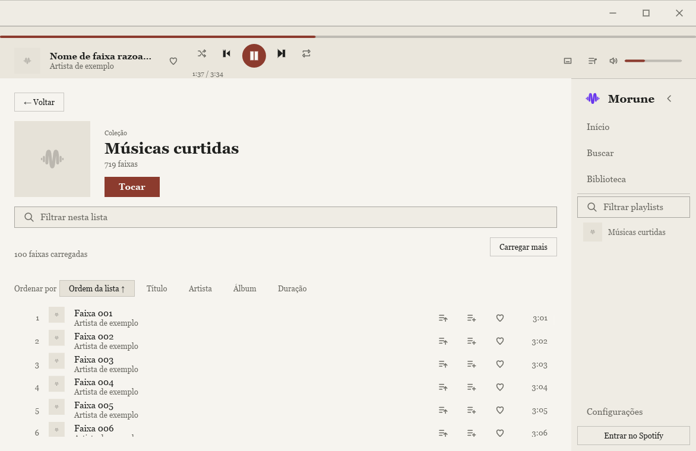

<div align="center">
  
  <h1>MORU•NE</h1>
  <p><strong>Your music. Your way.</strong></p>
  <p>A native, lightweight and deeply themeable Spotify client for Windows —<br>built to play your music while you play your game.</p>

  <p>
    <a href="https://github.com/SeitiFurumori/morune/releases"></a>
    <a href="https://github.com/SeitiFurumori/morune/actions/workflows/ci.yml"></a>
    <a href="LICENSE"></a>
    
    
  </p>

  <p><a href="README.pt-BR.md">🇧🇷 Leia em português</a></p>
</div>

<div align="center">
  
  <p><em>One app, four bundled themes. Notice Paper (bottom right): the sidebar moved to the right and the player to the top — themes change layout, not just color.</em></p>
</div>

> [!IMPORTANT]
> MORU•NE is in **alpha**. It is usable by testers but still has rough edges.
> Playback requires a Spotify Premium account.

## Why another Spotify client?

The official desktop client is an Electron app. It idles at hundreds of
megabytes, wakes the GPU to animate things nobody is looking at, and stutters
for a second when you alt-tab back to it. If you listen to music while gaming,
you feel all three.

MORU•NE is built around a single performance criterion: **be indistinguishable
from a stopped process while you play.** No stolen frames, no GPU wakeups, no
CPU contention, and no frozen window when you come back to it. Memory is a
ceiling to stay under, not a number to brag about — see
[PERFORMANCE.md](docs/PERFORMANCE.md) for the method and the real measurements,
including what has **not** been measured yet.

The second reason is ownership of how it looks. Most "themes" are a color
swap. Here a theme is a declarative package that controls color, typography,
shape, motion, spacing, icons, fonts and the composition of the window itself.

## What makes it different

- **Native and light** — Rust + [Slint](https://slint.dev). No Electron, no
  Chromium, no WebView. The installer is under 4 MB.
- **Built for the background** — closes to the system tray and keeps playing,
  with a tray menu and volume control for when a game is in the foreground.
- **Themes that change the layout** — sidebar position, player position,
  density, and content composition, not only colors.
- **Safe by construction** — themes are declarative data, never executable
  code. Your token lives in the Windows Credential Manager, never in a file.
- **Accessible** — a real AccessKit tree exposed to Windows, keyboard
  navigation, visible focus, and contrast enforced by a test.
- **Your Spotify, not a copy of it** — playback, playlists and liked songs use
  your account. MORU•NE never builds a parallel library.

## Screenshots

| Bruma (acrylic glass) | Cristal |
|---|---|
|  |  |

| Pulse | Paper (sidebar on the right) |
|---|---|
|  |  |

## Install

Download `Morune-<version>-setup.exe` from
[Releases](https://github.com/SeitiFurumori/morune/releases) and run it. No
admin rights required, and you pick the drive.

The installer is not code-signed yet, so Windows SmartScreen may show "Unknown
publisher". Verify the SHA-256 against the `.sha256` published in the same
release before installing:

```powershell
Get-FileHash .\Morune-0.1.0-setup.exe -Algorithm SHA256
```

See [installation, security and code signing](docs/SIGNING.md) for details.

### First run

1. Open MORU•NE.
2. Go to **Settings → Sign in to Spotify**.
3. Authorize in your browser.
4. Pick a song and press **Play**.

MORU•NE never sees your password. Spotify authenticates you in the browser and
the app stores only the token, in the Windows vault.

## What works today

- Spotify sign-in via OAuth with PKCE;
- search across tracks, albums, artists and playlists;
- playback, queue, shuffle, repeat, volume and media keys;
- liked songs synced with Spotify;
- library and playlists with progressive loading;
- manageable queue: play next, add to end, reorder, remove, clear, undo;
- import, export, preview and restore `.musicpack` themes;
- mini-player, system tray, and optional start with Windows;
- keyboard navigation, visible focus and native accessibility via AccessKit;
- adaptive layout down to a 720 × 480 window.

See the [roadmap](docs/ROADMAP.md) for what is planned and the
[UX audit](docs/UX_AUDIT.md) for current limitations.

## Themes

A theme is a directory or a `.musicpack` file made of TOML and assets:

```text
manifest.toml    identity and schema version
theme.toml       color, typography, shape, motion and effects
layout.toml      window composition
assets/          optional images and icons
fonts/           optional bundled fonts
```

Themes are validated on load: unsafe paths are rejected, absurd values are
clamped, and unreadable contrast produces a warning. A theme can be ugly on
purpose — it cannot be accidentally impossible to read.

Full reference: [THEMING.md](docs/THEMING.md).

## Building from source

Requirements: Windows, Rust 1.92+, and MinGW-w64 on `PATH` (`dlltool` and `as`).

```powershell
. .\tools\env.ps1
cargo build --release -p morune-app
cargo test --workspace
cargo clippy --workspace --all-targets -- -D warnings
```

To build the installer locally:

```powershell
.\tools\build-installer.ps1
```

Read the [contributing guide](CONTRIBUTING.md) first. Architecture, decision
records and the release process are indexed in [docs/](docs/README.md).

## License and trademarks

MORU•NE is released under the [MIT license](LICENSE). Third-party notices are
in [THIRD-PARTY-LICENSES.txt](THIRD-PARTY-LICENSES.txt).

MORU•NE is not affiliated with, associated with, or endorsed by Spotify.
Streaming uses [librespot](https://github.com/librespot-org/librespot) and
requires a Spotify Premium account. Spotify is a trademark of Spotify AB.
